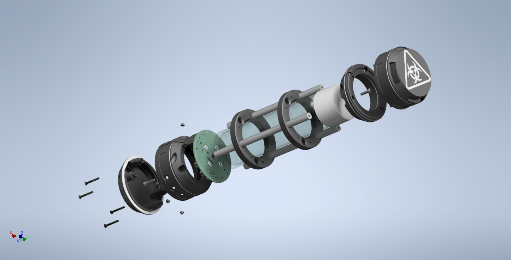

# RainbowHungover
You want to get trashed but regular bottles are too boring for you ? I've got just exactly what you need

## How it's made

The bottle is based around a VOSS bottle (small one) enclosed in 3D printed parts and aluminium bars

On the bottom is a PCB with 6 LED colors/wavelength (red, green, blue, 450nm, 420nm, 365nm). The 420nm is very powerful and makes a cool Cherenkob radiation effect and the 365nm makes tonic glow

Everything is held together with screws

## Pictures

The following pictures prove that the system is correctly working. The Husky showcases here is absolutely trashed (Fauntastic 5 2025)

This contraption also works with multiple users

The latest release brought multi-bottle mode, as showcased here

